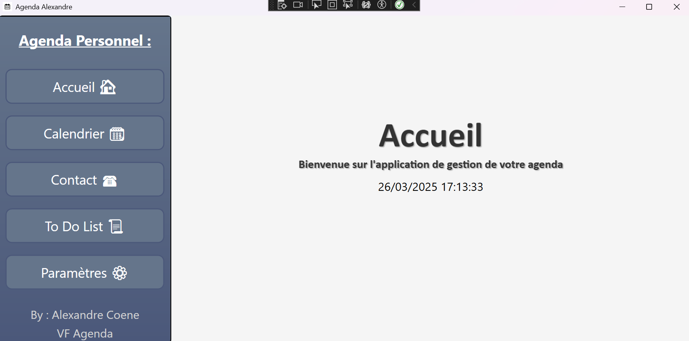
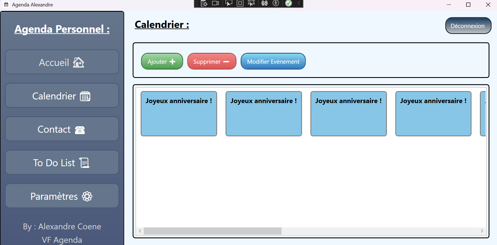
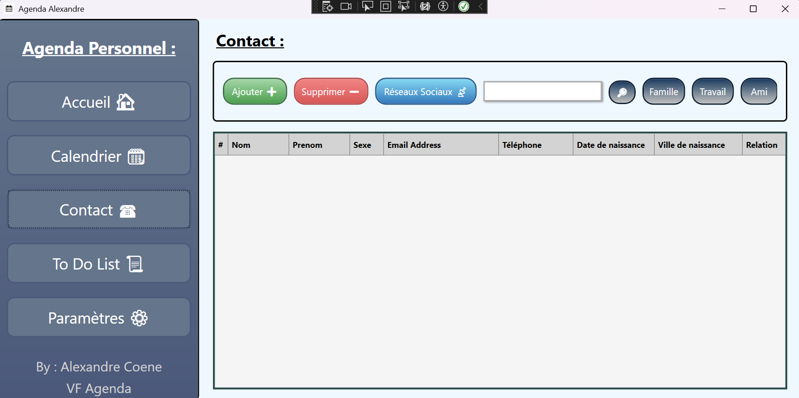
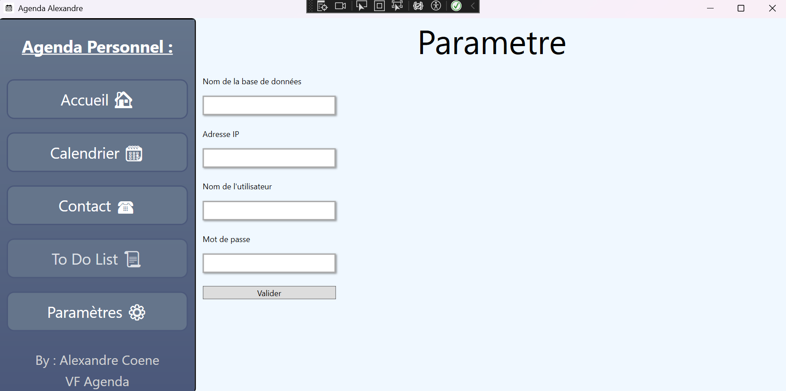

# 📅 Application Agenda WPF

Une application développée en C# avec .NET WPF permettant de gérer efficacement un agenda, d'ajouter des contacts et de suivre des événements importants.

## 🚀 Fonctionnalités

- 📆 Gestion des événements et des tâches  
- 📚 Ajout et gestion des contacts ainsi que de la To Do List
- ⏰ Notifications pour les événements à venir du calendrier Google
- 🗓️ Interface intuitive pour visualiser les calendriers avec la possibilité de parametré le compte google et la BDD souhaité

## 🛠 Technologies utilisées

- C#  
- .NET WPF  
- SQLite ou autre base de données pour la gestion des événements et des contacts  
- Notifications Windows  

## 📸 Aperçu

### 🏠 Accueil de l'Agenda  

### 📅 Vue du Calendrier  

### 📇 Gestion des Contacts  

### ⚙️ Paramètres de l'Agenda  

## 📝 Auteur

- **Coene Alexandre** - [GitHub](https://github.com/AlexandreCoene)
